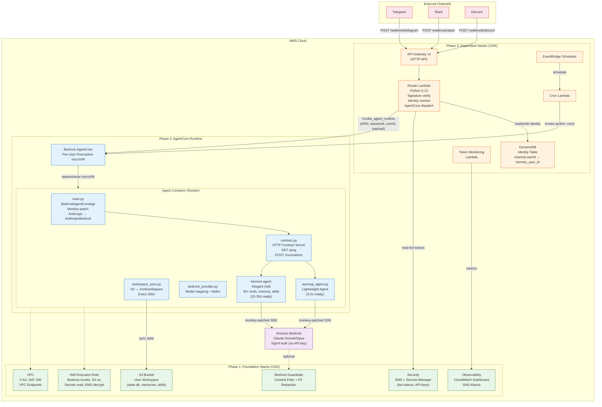
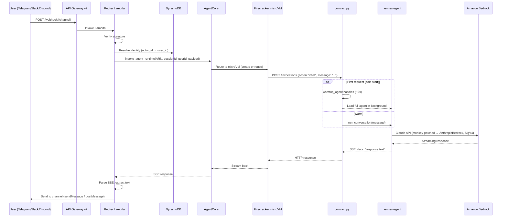
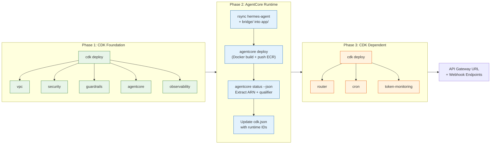
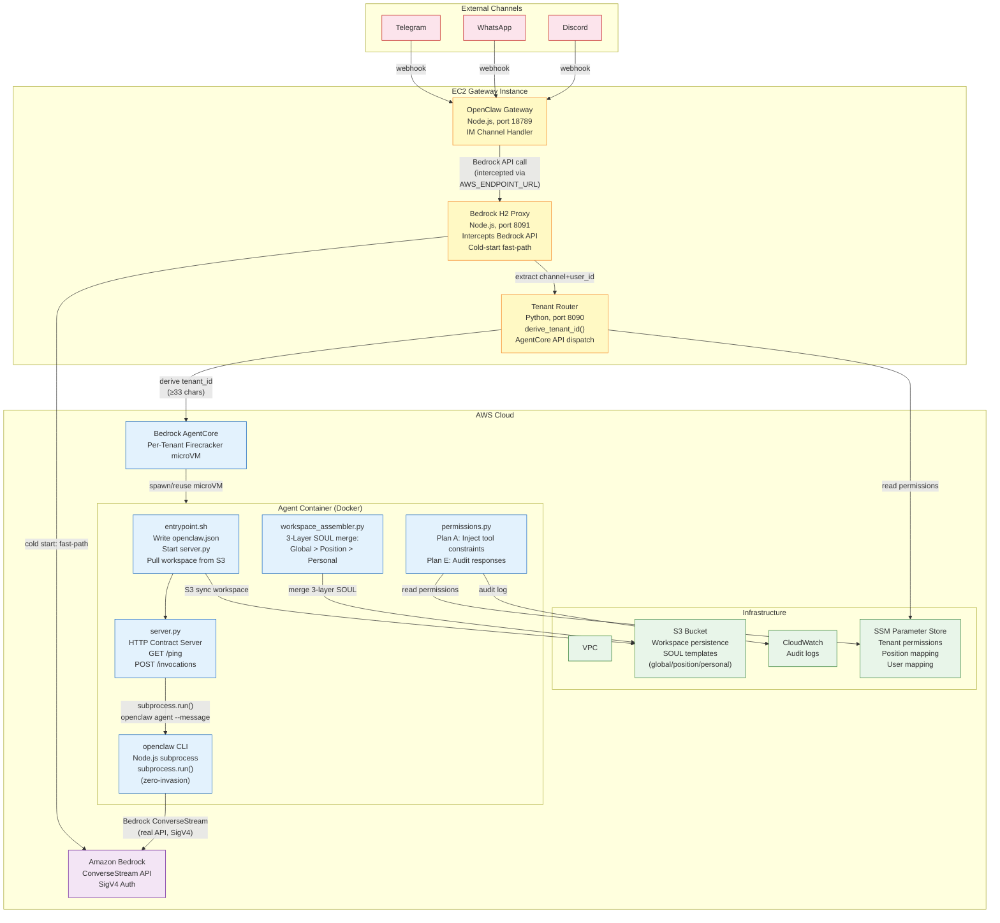
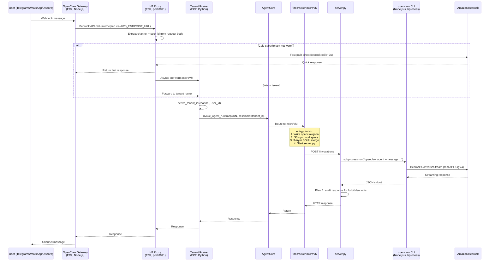
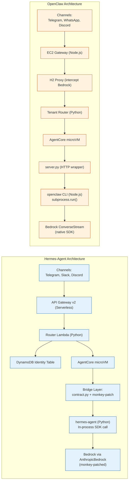

# Architecture Diagrams: Hermes vs OpenClaw on Bedrock AgentCore

Two Mermaid architecture diagrams comparing the Hermes-Agent and OpenClaw deployments on Amazon Bedrock AgentCore.

---

## 1. Hermes-Agent on Bedrock AgentCore

### Hermes Request Flow

### Hermes Deployment Flow

---

## 2. OpenClaw on Bedrock AgentCore

### OpenClaw Request Flow (6 Hops)

---

## 3. Side-by-Side Comparison

### Feature Comparison Table

| Dimension | Hermes-Agent | OpenClaw |
|-----------|-------------|----------|
| **Agent Language** | Python | Node.js |
| **Gateway** | Serverless (API GW + Lambda) | EC2 (Node.js + H2 Proxy) |
| **Agent Integration** | In-process SDK call (monkey-patch) | CLI subprocess (`openclaw agent --message`) |
| **Bedrock Routing** | Monkey-patch `Anthropic` → `AnthropicBedrock` | Environment variable hijack (`AWS_ENDPOINT_URL`) |
| **Tenant Isolation** | session_id per user | tenant_id derived from channel+user (≥33 chars) |
| **Identity Store** | DynamoDB | SSM Parameter Store |
| **State Persistence** | S3 workspace sync (every 300s) | S3 workspace sync (every 60s) |
| **Cold Start** | Dual-agent: warmup (2s) + full (10-30s) | H2 Proxy fast-path direct Bedrock (~3s) |
| **Permission Model** | Bedrock Guardrails (content filter + PII) | Plan A (SOUL injection) + Plan E (audit regex) |
| **SOUL/Persona** | Single system prompt | 3-layer merge (global > position > personal) |
| **Deployment** | 3-phase: CDK → AgentCore CLI → CDK | EC2 + AgentCore CLI |
| **CDK Stacks** | 8 stacks (vpc, security, guardrails, agentcore, observability, router, cron, token-monitoring) | CloudFormation (VPC, EC2, IAM) |
| **Channels** | Telegram, Slack, Discord (+ ECS gateway planned for WeChat, Feishu) | Telegram, WhatsApp, Discord (via OpenClaw native) |
| **Scheduling** | EventBridge Scheduler → Lambda → AgentCore | Not documented |
| **Monitoring** | CloudWatch dashboard + SNS alarms + token budget | CloudWatch audit logs |
| **Container Base** | Python 3.11-slim (~65MB) | Python 3.12-slim + Node.js (~800MB+) |
| **Hops (user→LLM)** | 4 (APIGW → Lambda → AgentCore → Bedrock) | 6 (GW → H2 → Router → AgentCore → CLI → Bedrock) |
